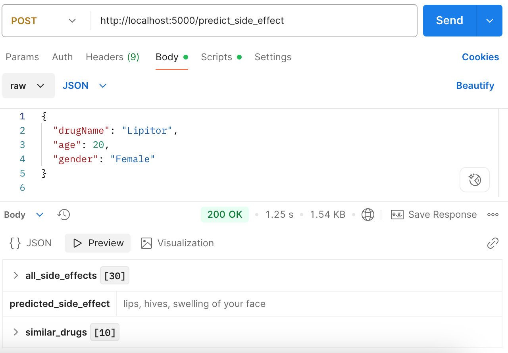
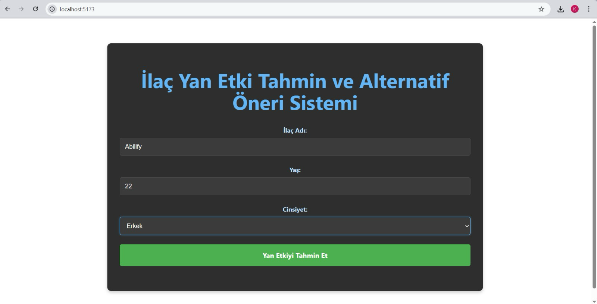
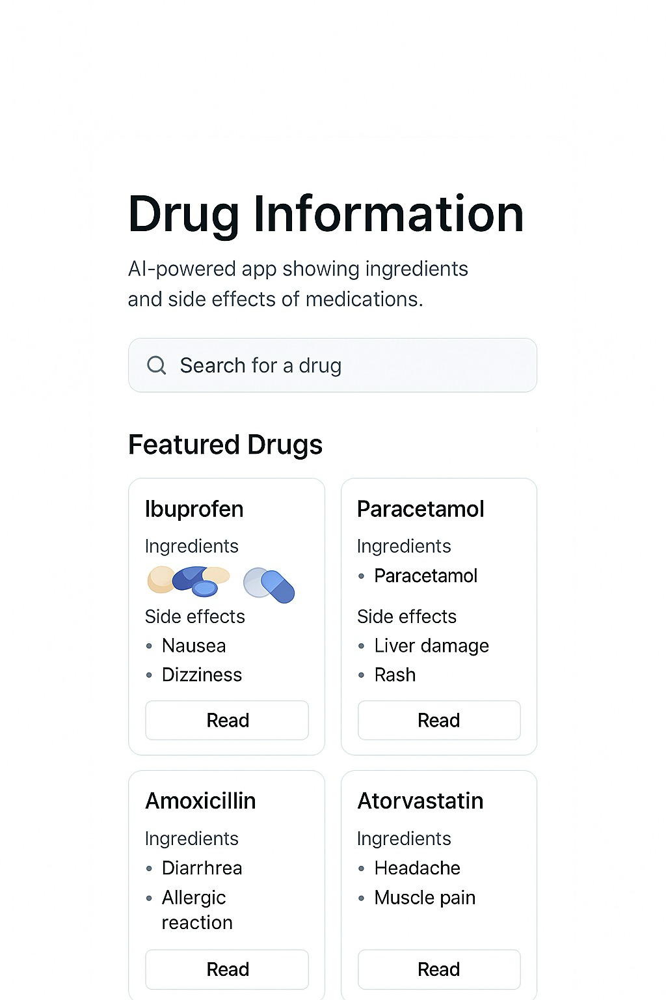
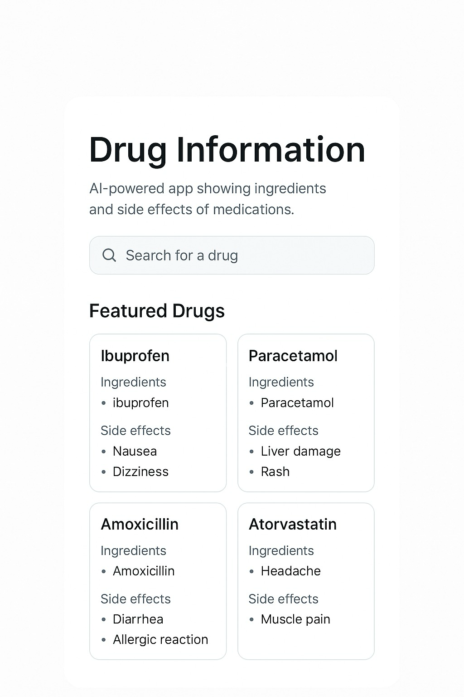

# YZTA-2025

## 👤 Takım Üyesi
1) Zeynep Danış – Scrum Master  
[LinkedIn](https://linkedin.com/in/zeynepdanis)

2) Fatmanur Kaya - Developer
[LinkedIn]()

3) Emre Pamukcu - Developer
[LinkedIn]()

4) Kerem Emre - Developer
[LinkedIn]()

---
## Takım & Proje Adı
  PharmaMind

---

## 🖼️ Proje Logosu
> Logo eklenecek 

---

## 📝 Proje Açıklaması

### İlaç Yan Etki Tahmin ve Alternatif Öneri Sistemi

    Bu projenin amacı, kullanıcıdan alınan giriş bilgileri (ilaç adı, yaş, cinsiyet, hastalık gibi) doğrultusunda:
     a) İlaçla ilişkili bilinen tüm yan etkileri görüntülemek,

     b) Yapay zeka algoritması ile, kullanıcı profilini dikkate alarak en muhtemel yan etkiyi tahmin etmek,

     c) Yan etki profiline benzer olan alternatif ilaçları önermek,Ve tüm bu süreçleri sade bir web arayüzü üzerinden erişilebilir hale getirmektir.

Bu sistem, ilaç kullanıcılarına veya sağlık çalışanlarına, olası yan etkiler konusunda daha bilinçli kararlar alma imkânı sunar.

---

## ❓ Neden Bu Projeye İhtiyaç Var?

Birçok kişi ilaçları, potansiyel yan etkilerini tam olarak bilmeden kullanıyor. Oysa bu etkiler; yaş, cinsiyet ve mevcut hastalık gibi kişisel faktörlere göre değişebilir.

Bu proje, bu ihtiyaca çözüm sunmak için geliştirildi. Sağladıkları:

- Yapay zekâ ile **kişiye özel yan etki tahmini**,  
- Her ilaç için **bilinen tüm yan etkilerin listesi**,  
- **Yan etki profiline göre benzer ilaç önerileri**.

🎯 Amaç: Daha bilinçli, güvenli ve kişiselleştirilmiş ilaç kullanımı sağlamak; yapay zekâyı sağlık kararlarına entegre etmektir.

---

## 📋 Proje Gereksinimleri

Bu proje iki ana bileşenden oluşmaktadır: Flask tabanlı Python backend ve React tabanlı frontend.

### 🔧 Backend (Python - Flask)

- Python 3.8+
- Flask
- scikit-learn
- pandas
- numpy
- joblib
- flask-cors

### Frontend (React)
- Node.js 14+
- React 18+
---

## 🎯 Hedef Kitle

Bu proje aşağıdaki kullanıcı profillerine hitap etmektedir:

- 💊 **İlaç kullanan bireyler**: Kullandıkları ilaçların olası yan etkilerini daha iyi anlamak isteyen kullanıcılar.  
- 🧪 **Sağlık profesyonelleri**: Eczacılar, doktorlar, hemşireler ve klinik personel için hızlı ön bilgi ve alternatif ilaç önerisi sunar.  
- 👩‍💻 **Yazılım geliştiriciler / veri bilimi öğrencileri**: Yapay zekâ destekli sağlık projelerine ilgi duyan kişiler için öğretici bir örnek teşkil eder.  
- 📚 **Tıp ve sağlık teknolojileri öğrencileri**: Veri bilimi ve klinik karar destek sistemleri hakkında pratik uygulamalar görmek isteyenler.

---
## Gereksinimler 

### 🔍 İşlevsel Gereksinimler (Functional Requirements)

- Kullanıcı, ilaç adını girerek o ilaca ait tüm yan etkileri görebilmelidir.  
- Kullanıcı, yaş, cinsiyet ve hastalık bilgilerini girerek kendisine özel yan etki tahmini alabilmelidir.  
- Sistem, yapay zekâ modeli ile en olası yan etkiyi tahmin etmelidir.  
- Sistem, yan etki profiline göre benzer ilaç önerileri sunmalıdır.  
- Kullanıcı, sade bir web arayüzü üzerinden bu tüm bilgilere ulaşabilmelidir.  

---

### 🛠️ Teknik Gereksinimler (Non-Functional Requirements)

-  Sistem hızlı çalışmalı, tahminler birkaç saniye içinde dönmelidir.  
-  Web arayüzü mobil ve masaüstü cihazlarda uyumlu olmalıdır.  
-  Backend API’leri RESTful yapıda olmalıdır.  
-  Model ve öneri sistemleri geliştirilebilir, yeniden eğitilebilir olmalıdır.  
- Güvenliğe ve veri gizliliğine dikkat edilmelidir (kişisel veri alınmıyorsa bu belirtilmelidir).  

---

---

## 🗂️ Backlog & Sprint Board

👉 [Notion Board (Backlog & Sprint Takibi)](https://www.notion.so/2255b5f5bd1a80caa55bf07e87c3e3ee?v=2255b5f5bd1a80c3908b000c16ec9b6d&source=copy_link)

---

## İletişim ve Koordinasyon
Bu proje kapsamında takım içi iletişim, günlük paylaşımlar ve toplantı duyuruları için WhatsApp Community kullanılması kararlaştırılmıştır.

Toplantılar (Daily, Sprint Planning, Review, Retrospective) ve genel koordinasyon bu kanal üzerinden yürütülmektedir.

👉 Katılım için topluluk linki: [WhatsApp Topluluğuna Katıl](https://chat.whatsapp.com/GxAE2ytOSIvENwuigH49zg?mode=r_c)

---
## 🗓️ Sprint 1 – Başlangıç ve Hazırlık

### 📅 Sprint Süresi:
**1 hafta**  
> Not: Ekip ile geç iletişime geçildiği için sprint süresi kısaltılmış ve ağırlıklı olarak hazırlık süreci olarak değerlendirilmiştir.
---
## 🗂️ Backlog & Sprint Board

👉 [Notion Board (Backlog & Sprint Takibi)](https://www.notion.so/2255b5f5bd1a80caa55bf07e87c3e3ee?v=2255b5f5bd1a80c3908b000c16ec9b6d&source=copy_link)

## 📌 Sprint Board

  

## 🌐 Community Images

  

---

### 🎯 Sprint Hedefi:
Projenin temel yapısının kurulması, görevlerin netleştirilmesi, araç ve iletişim kanallarının belirlenmesi.

---

### ✅ Tamamlanan İşler:

#### 🔧 Proje Hazırlığı ve Organizasyon
- Proje fikri belirlendi: *İlaç Yan Etki Tahmin ve Öneri Sistemi*
- Hedef kullanıcı ve sistem işlevleri tanımlandı
- Kullanılacak teknolojiler belirlendi:
  - Backend: **Python (Flask)**
  - Frontend: **React**
  - ML: **Logistic Regression + TF-IDF**
- GitHub reposu oluşturuldu
- Notion sayfası oluşturuldu (görev takibi ve dokümantasyon için)
- Kullanılacak destek araçları belirlendi: Google Drive, WhatsApp Community

#### 🧠 Scrum Süreci Kurulumu
- Product Backlog oluşturuldu
- Tüm görevlere user story yazıldı ve kabul kriterleri belirlendi.
- Tüm görevler için Story Point atamaları yapıldı
- Daily Scrum’ların WhatsApp Community üzerinden yapılmasına karar verildi ve uygulanmaya başlandı

---

### 📌 Sprint 1'de Tamamlanan Görevler:

| Görev | Tip | Durum |
|-------|-----|--------|
| Proje fikrinin netleştirilmesi | Organizasyon | ✅  
| Teknoloji ve araçların belirlenmesi | Organizasyon | ✅  
| Görev listesi ve efor puanlarının oluşturulması | Planlama | ✅  
| GitHub ve Notion ortamlarının hazırlanması | Teknik | ✅  
| Scrum uygulama biçiminin netleştirilmesi | Süreç | ✅  

---
### Tamamalanan Puan ve Puan Tamamlama
---
#### ⚠️ Sprint Efor Durumu:
- Toplam proje puanı belirlendi: **43 Story Point**
- Sprint 1’de doğrudan teknik geliştirme yapılmadığı için puan tamamlanmamıştır
- Teknik görevler Sprint 2’ye taşınmıştır

---

### 🔜 Sprint 2 Hazırlıkları:
- Veri temizleme ve model eğitimine başlama
- Flask API’nin oluşturulması
- React arayüz taslağının hazırlanması
- Logo ve temel UI tasarımının belirlenmesi

---

### Sprint Review :
---

#### 🔍 Gözden Geçirilen Öğeler:
- Proje fikri netleştirildi
- Kullanılacak teknoloji ve araçlar belirlendi
- Görev dağılımı yapıldı, backlog oluşturuldu
- Story point puanlaması tamamlandı
- GitHub ve Notion ortamları kuruldu
- Daily Scrum yöntemi tanımlandı (WhatsApp Community üzerinden)

---

#### 📊 Tamamlananlar:
- Projenin teknik ve organizasyonel temeli başarıyla atıldı.
- Geliştirme yapılmadı ancak geliştirmeye hazır ortamlar ve süreçler oluşturuldu.
- Tüm görevler sprint planında yer aldığı şekilde tamamlandı.

---

### ⚠️ Tamamlanamayanlar:
- Teknik geliştirmeye başlanamadı (zaman sınırlı olduğu için)
- İlk model, API veya frontend görevlerine başlanmadı

---

## 🔁 Sprint 1 Retrospektif 

### 💬 Ne İyi Gitti?
- Proje net ve somut bir fikre dönüştürüldü
- İletişim kanalı olarak WhatsApp Community efektif çalıştı
- Araç seçimi (GitHub, Notion, Drive) sorunsuz yapıldı
- Görevler net ve iyi tanımlandı, story point'ler uygun tahminlendi

---

### 🚧 Ne Geliştirilebilir?
- Geliştirmeye geçiş daha hızlı olabilirdi (iletişim geç başlatıldığı için bu sprint sadece hazırlıkla geçti)
- Geliştirici görevlerinin parçalanması ve teknik dokümantasyon Sprint 2’ye kalmadan başlatılabilirdi

---

### ✅ Neleri Koruyacağız?
- Net ve basit görev tanımları
- WhatsApp üzerinden günlük iletişim
- Hafif ve sade araç kullanımı (Notion + GitHub yeterli)

---

### 🎯 Sprint 2 için Öneriler:
- Teknik görevler sprint başında başlatılmalı (model ve backend öncelikli)
- Daily Scrum çıktıları Notion’da kısaca arşivlenebilir

---
## 🗓️  Sprint 2 – Veri & Model Geliştirme

### 📅 Sprint Süre:

2 hafta

## 📂 Backlog & Sprint Board
---
## 👉 Notion Board (Backlog & Sprint Takibi)
👉 [Notion Board (Backlog & Sprint Takibi)](https://www.notion.so/2255b5f5bd1a80caa55bf07e87c3e3ee?v=2255b5f5bd1a80c3908b000c16ec9b6d&source=copy_link)
---
### 🌐 Sprint Board

  

---
### 🌐 Community Images

---
## 🌟 Sprint Hedefi:

Modelin geliştirilmesi, veri zenginleştirme çalışmasının tamamlanması ve temel API'nin yayına alınması.

---

## ✅ Tamamlanan İşler:
---
#### 🔧 Veri Temizleme & Zenginleştirme

- Veri seti düzenlendi: drug_name, age_group, gender, specific_side_effects alanları sadeleştirildi

- Tekrarlı girdiler temizlendi, grup bazlı yan etkiler birleştirildi

- Yaş numeric değerden age_group etiketi olarak eğitim setine uyarlandı
---
#### 🧐 Model Geliştirme

- TF-IDF + Logistic Regression modeli ile yan etki tahmini modeli eğitildi

- Model için %70+ başarı oranına ulaşıldı

- Model dosyaları (.pkl) kaydedildi ve servis edilecek hale getirildi
---
#### 🚀 Backend API (Flask)

- /predict_side_effect endpoint'i gerçek modelle entegre edildi

- Girdilere göre tahmin + benzer ilaç + yan etki listesini döndürecek şekilde servis yayına alındı

- Model, TF-IDF ve encoder dosyaları API tarafında dinamik şekilde yüklenebilir hale getirildi
---
#### 💻 Frontend (React)

- React projesi başlatıldı

- Geçici bir form sayfası geliştirildi (input alanları: ilaç adı, yaş, cinsiyet)

- Tasarım üzerine çalışılmaya devam ediliyor, güncellenmiş tasarıma göre yeniden yazılacak
---
## Tamamalanan Puan ve Puan Tamamlama
---
#### ⚠️ Sprint Efor Durumu:
- Toplam proje puanı belirlendi: **43 Story Point**
- Sprint 2 de 26 efor puanı tammalandı.
📋 Sprint Review
---
## 🔍 Gözden Geçirilenler:

- Model çıktıları test edildi ve hedef doğruluk seviyelerine ulaşıldı

- API uçtan uca test edildi (tahmin + veri getirme + benzer öneri)

- Frontend tarafından form yapısı çalışıyor hale getirildi

- Tüm ekip üretken çalıştı, her rolde katkı sağlandı.
---

## 📊 Tamamlananlar:

- Model doğruluk hedefleri sağlandı

- Flask backend eksiksiz geliştirildi

- React frontend başlatıldı ve entegrasyona hazır hale getirildi.
---
## Sprint 2 de Tamamlanan Görevler
| Görev                                  | Tip      | Durum |
| -------------------------------------- | -------- | ----- |
| Veri setinin temizlenmesi              | Veri     | ✅     |
| Yan etki modelinin eğitilmesi          | ML       | ✅     |
| Flask API entegrasyonu                 | Backend  | ✅     |
| Model dosyalarının kaydedilmesi        | ML       | ✅     |
| React projesinin başlatılması          | Frontend | ✅     |
| Test sayfasının hazırlanması           | Frontend | ✅     |
| Benzer ilaç öneri mantığının eklenmesi | Backend  | ✅     |

#### Images :
### . // API test edildi .Model girdilerie göre tahmin yürütüp sonuç çıkarıyor.
###  // reactta oluşturulan form tasarım üzerine çalışılıyor. 
###   // Üzerinde çalışılan tasarımlar  

## ⚠️ Tamamlanamayanlar:

- Frontend tasarımının güncel halinin uygulanması Sprint 3'e kaldı
---

## 🔄 Sprint 2 Retrospektif

### 💬 Ne İyi Gitti?

- Tüm teknik bileşenler paralel geliştirildi

- API testleri doğru kurgulandı, model eşleşmesi sorunsuz

### 🚧 Ne Geliştirilebilir?

- Frontend gelişimi backend kadar hızlı ilerlemedi, bu dengenin kurulması gerekiyor

- Tasarım geliştirme birlikte ilerlemeli

### ✅ Neleri Koruyacağız?

- Görev dağılımı ve story point sistematiği

- Doğrudan model + API + test yapısının birlikte geliştirilmesi

### 🌟 Sprint 3 Çıktılarına Hazırlık

- UI/UX tasarımının tamamlanması

- Test ve demo sunumu için arayüz düzenlemeleri

> ✨ Bu proje bir eğitim bootcamp’i kapsamında geliştirilmiştir.